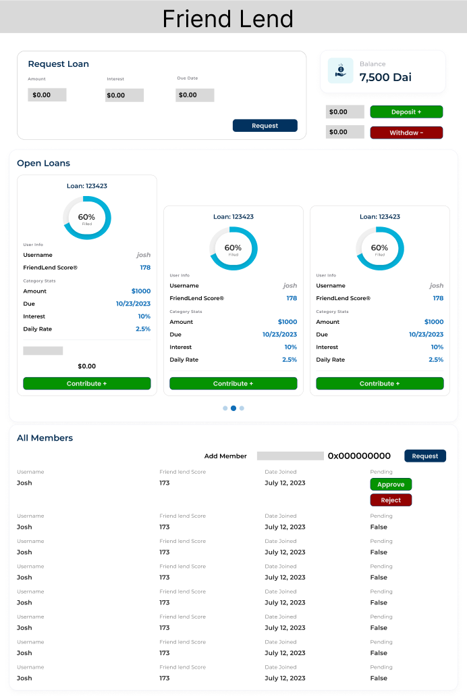

# defi-friendlend

## Flow of Normal Logic Example

In this scenario, Josh, Dylan, and Joey are part of a lending group. The following steps demonstrate how a new member, Cyril, is invited, a loan is requested and funded, and the repayment and withdrawal processes occur.

### Step 1: Josh Proposes a New Invite for an ETH Address
- **Josh**: `proposeInvite(0x123456789ABCDEF...);`

### Step 2: Dylan and Josh Vote "Yes," Joey Votes "No"
- **Josh**: `voteOnPendingPerson(0x123456789ABCDEF..., true);`
- **Dylan**: `voteOnPendingPerson(0x123456789ABCDEF..., true);`
- **Joey**: `voteOnPendingPerson(0x123456789ABCDEF..., false);`

### Step 3: Cyril is Admitted to the Network By Majority
- **Cyril**: `join("Cyril");`

### Step 4: Josh & Dylan Each Transfer $800 into the Pool
- **Josh**: `depositFunds(value: 800);`
- **Dylan**: `depositFunds(value: 800);`

### Step 5: Cyril Requests a Loan for $1000 for Investing in BananaCoin
- **Cyril**: `requestLoan(1000, 10%, now + 1 week, "Invest in BananaCoin");`

### Step 6: Dylan Contributes $800 and Josh Contributes $200 to Fill the Loan Request
- **Dylan**: `fillLoanRequest(loanId, 800);`
- **Josh**: `fillLoanRequest(loanId, 200);`

### Step 7: Cyril's Loan Automaticaly Repays From His Balance
- **System**: `autoPayLoan(loanId, 1100);`

### Step 8: Josh Withdraws All His Money from the Pool
- **Josh**: `withdrawFunds(220);`

## Other Cases/Examples

### Case Default: Loan Repayment Time Expires for Cyril's $1000 Loan
- The smart contract automatically detects the default when the repayment time expires and balance is not high enough and kicks cyril from the group adding him to a banned list of IDs for rejoining. It first emptys Cyrils balance and disributes it to creditors proportunitaley.
- **System**: `default(0xAddressOfCyril);`

### Case Cancel: Cyril Cancels Loan Befroe Fulfilment
- Cyril Decides to Cancel his loan request before it is filled and funds are refunded to contributors
- **Cyril**: `cancelLoan(loanID);`

### Case PayNow: Cyril Pays his Loan before the alloted period
- Cyril Decides to pay his loan request before it is automatically paid. This enables him to request a new loan (which is the primary reason for paying early).
- **Cyril**: `payNowLoan(loanID);`

## Front End Design

### Main Layout

The main screen consists of the following components:
- **My Loan Info** (top left)
  - See more details in **My Loan Info**
- **Balance Info** (top right)
  - Ability to deposit/withdraw in/out of pool
- **Open Loans** (middle)
  - Shows all open loans
  - Each loan shows the following info:
    - Loan ID
    - Percent of total filled
    - Username of loan requester
    - FriendLend score®
    - Amount Requested
    - Loan Maturity Date
    - Total Interest Rate
    - Calculated Daily Rate
  - Have the option to contribute to loan
    - Can contribute between 1 Dai and remaining unfilled amount
    - Must have at least that much in balance to contribute
- **All Members** (bottom)
  - Option to invite new members based on ETH public key
  - Pending users at the top
    - Have option to approve or reject
  - All members have username, FriendLend score®, & Date joined listed

**My Loan Info** (top left) has various states:
- **State 1: No current loan requested**
  - Option to request a new loan & set amount, interest rate, and due date
- **State 2: Current Unfilled Loan Open**
  - Option to cancel loan and refund backers
- **State 3: Current Filled Loan Active**
  - Option to repay early which allows you to open a new loan

## Back End Architecture

### Structs

#### Member Struct
Stores all the relevant information of a user in the network. A user is represented as a `Member` in the system.

- `address memberAddress`: The Ethereum address of the member.
- `string username`: The chosen username of the member in the FriendLend platform.
- `uint256 friendScore`: The FriendLend score of the member which can be a representation of their reliability and reputation within the platform.
- `uint256 balance`: The amount of currency (e.g., Ether) that the member has deposited in the FriendLend pool.
- `bool isPending`: A flag to indicate if the member's invitation is still pending based on the votes.
- `uint256 dateAdded`: A timestamp of when the member was added to the network. This is likely the block timestamp when the member was added.

#### Loan Request Struct
Contains the details of a loan request by a borrower.

- `address borrower`: The Ethereum address of the member requesting the loan.
- `uint256 amount`: The total amount of currency being requested for the loan.
- `uint256 filled`: The amount of the loan that has already been funded by lenders.
- `uint256 dueDate`: The timestamp of when the loan is to be repaid in full.
- `bool isFulfilled`: A flag to indicate if the loan request has been completely filled.
- `mapping(address => uint256) contributions`: A mapping of addresses to the amount of currency each has contributed to the loan. This allows tracking of individual contributions and is crucial for managing repayments, cancellations, or defaults.

### Functions

#### User Post Functions
These are the functions that users can call to perform transactions and alter the state of the contract. They include functions to handle deposits, loan requests, voting, and repayments.

- `proposeInvite(address)`: Propose a new member to the group by submitting their Ethereum address.
- `voteOnPendingPerson(address, bool)`: Vote on whether to admit a pending member into the group.
- `join(string)`: A new member uses this function to join after being approved.
- `depositFunds(uint256)`: Deposit funds into the lending pool.
- `requestLoan(uint256, uint256, uint256, string)`: Request a new loan specifying the amount, interest rate, repayment date, and a description.
- `fillLoanRequest(uint256, uint256)`: Contribute to a loan request.
- `withdrawFunds(uint256)`: Withdraw funds from the lending pool.
- `cancelLoan(uint256)`: Cancel an unfilled loan request and trigger refunds.
- `payNowLoan(uint256)`: Pay off an outstanding loan early.

#### User Get Functions
These functions are called by users to retrieve information from the contract without making any transactions, typically to display data in the UI.

- `getMemberDetails(address)`: Retrieve the details of a specific member, such as their username, FriendLend score, and balance.
- `getLoanDetails(uint256)`: Get detailed information about a specific loan request.
- `getPendingMembers()`: List all members whose membership is still pending based on votes.
- `getActiveLoans()`: Get a list of all active loan requests that are yet to be fulfilled.

#### System Functions
Functions that the system calls automatically to enforce the rules of the contract. These functions may be triggered by transactions or by time-based events.

- `autoPayLoan(uint256)`: Automatically deduct repayment amounts from a borrower's balance once the loan is due.
- `default(address)`: Handle a loan default, remove the borrower from the group, distribute their balance to creditors, and add the borrower to the banned list.

#### Other Helper Functions
Utility functions that support the contract's operations and provide additional functionality. They might include functions for internal calculations, logging, or contract maintenance tasks.

- `calculateInterest(uint256, uint256, uint256)`: Calculate the due interest on a loan based on the principal, rate, and time.
- `updateFriendScore(address, uint256)`: Update the FriendLend score of a member based on their activity and loan repayment behavior.
- `logActivity(string)`: Log a user's activity for auditing purposes.
- `checkMembershipStatus(address)`: Check if a user's membership application has been approved or is still pending.
